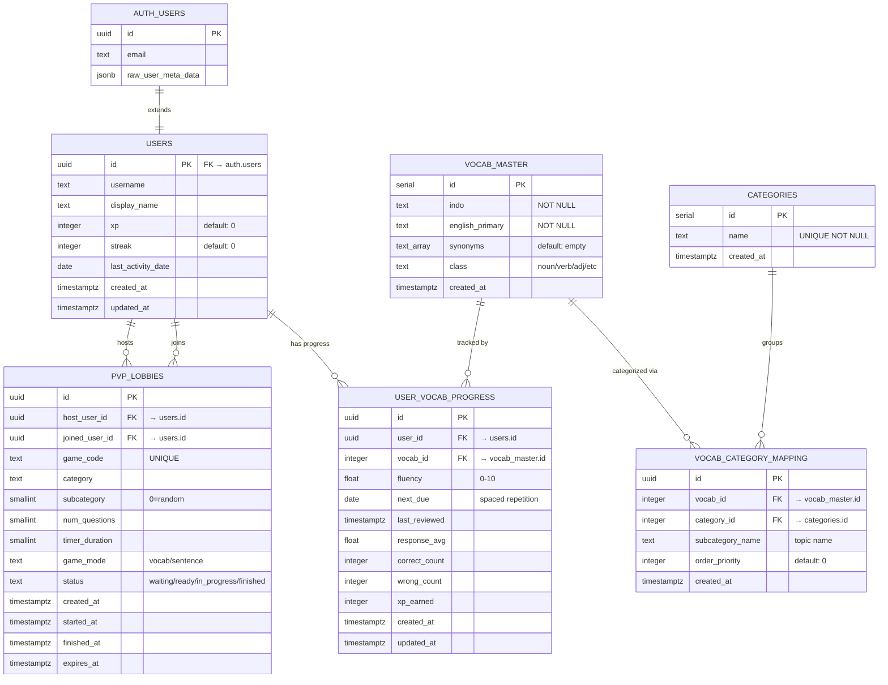

# 🗄️ Ryurex Edu - Database Schema

> Database menggunakan **Supabase (PostgreSQL)** dengan Row Level Security (RLS).

---

## 📊 Entity Relationship Diagram

---

## 📋 Detail Tabel

### 1. `users` — Profil Pengguna

Extends `auth.users` dari Supabase. Auto-created saat user signup via trigger.

| Kolom | Tipe | Default | Keterangan |
|---|---|---|---|
| `id` | `uuid` PK | — | FK → `auth.users(id)`, CASCADE delete |
| `username` | `text` | — | Dari metadata atau email prefix |
| `display_name` | `text` | — | Nama tampilan |
| `xp` | `integer` | `0` | Experience points total |
| `streak` | `integer` | `0` | Login streak harian |
| `last_activity_date` | `date` | — | Tanggal aktivitas terakhir |
| `created_at` | `timestamptz` | `now()` | — |
| `updated_at` | `timestamptz` | `now()` | Auto-update via trigger |

**Level Formula:** `level = FLOOR(xp / 100) + 1`

---

### 2. `vocab_master` — Master Data Kosakata

Berisi seluruh kata yang tersedia di game. Read-only untuk user.

| Kolom | Tipe | Default | Keterangan |
|---|---|---|---|
| `id` | `serial` PK | auto | — |
| `indo` | `text` NOT NULL | — | Kata dalam Bahasa Indonesia |
| `english_primary` | `text` NOT NULL | — | Kata utama dalam Bahasa Inggris (untuk underscore display) |
| `synonyms` | `text[]` | `'{}'` | Array sinonim yang diterima sebagai jawaban benar |
| `class` | `text` | — | Kelas kata: noun, verb, adjective, dll |
| `created_at` | `timestamptz` | `now()` | — |

**Indexes:** `class`

> **Note:** Category/subcategory sekarang dikelola via tabel `categories` + `vocab_category_mapping` (many-to-many).

---

### 2b. `categories` — Master Kategori

Daftar master nama kategori.

| Kolom | Tipe | Default | Keterangan |
|---|---|---|---|
| `id` | `serial` PK | auto | — |
| `name` | `text` UNIQUE NOT NULL | — | Nama kategori (e.g. 'Daily Life', 'Family') |
| `created_at` | `timestamptz` | `now()` | — |

---

### 2c. `vocab_category_mapping` — Junction Table (Many-to-Many)

Menghubungkan kata (`vocab_master`) ke kategori (`categories`) dengan topik dinamis.

| Kolom | Tipe | Default | Keterangan |
|---|---|---|---|
| `id` | `uuid` PK | `uuid_generate_v4()` | — |
| `vocab_id` | `integer` FK | — | → `vocab_master(id)`, CASCADE delete |
| `category_id` | `integer` FK | — | → `categories(id)`, CASCADE delete |
| `subcategory_name` | `text` NOT NULL | — | Nama topik (e.g. 'Main Family', 'Kitchen Tools') |
| `order_priority` | `integer` | `0` | Urutan tampilan |
| `created_at` | `timestamptz` | `now()` | — |

**Indexes:** `(category_id, subcategory_name)`, `(vocab_id)`

---

### 3. `user_vocab_progress` — Progress Belajar User

Tracking per-kata untuk setiap user. Mendukung spaced repetition.

| Kolom | Tipe | Default | Keterangan |
|---|---|---|---|
| `id` | `uuid` PK | `uuid_generate_v4()` | — |
| `user_id` | `uuid` FK | — | → `users(id)`, CASCADE delete |
| `vocab_id` | `integer` FK | — | → `vocab_master(id)`, CASCADE delete |
| `fluency` | `float` | `0` | Level fluency 0-10 |
| `next_due` | `date` | `CURRENT_DATE` | Tanggal review selanjutnya (spaced repetition) |
| `last_reviewed` | `timestamptz` | — | Kapan terakhir direview |
| `response_avg` | `float` | `0` | Rata-rata waktu respons |
| `correct_count` | `integer` | `0` | Total jawaban benar |
| `wrong_count` | `integer` | `0` | Total jawaban salah |
| `xp_earned` | `integer` | `0` | XP dari kata ini |
| `created_at` | `timestamptz` | `now()` | — |
| `updated_at` | `timestamptz` | `now()` | Auto-update via trigger |

**Constraint:** `UNIQUE(user_id, vocab_id)` — 1 record per kata per user

---

### 4. `pvp_lobbies` — Lobby PvP Multiplayer

Menyimpan data game PvP antara 2 pemain.

| Kolom | Tipe | Default | Keterangan |
|---|---|---|---|
| `id` | `uuid` PK | `uuid_generate_v4()` | — |
| **Players** |||
| `host_user_id` | `uuid` FK | — | Player yang buat lobby |
| `joined_user_id` | `uuid` FK | — | Player yang join, SET NULL on delete |
| **Game Config** |||
| `game_code` | `text` UNIQUE | — | Kode lobby (contoh: "ABC123") |
| `category` | `text` | — | Kategori kosakata |
| `subcategory` | `smallint` | — | 0 = random, 1-5 = custom |
| `num_questions` | `smallint` | — | Jumlah soal (≥1) |
| `timer_duration` | `smallint` | — | Timer per soal dalam detik (≥5) |
| `game_mode` | `text` | — | `'vocab'` atau `'sentence'` |
| `random_seed` | `text` | — | Untuk konsistensi soal acak |
| **Status** |||
| `status` | `text` | `'waiting'` | `waiting` → `opponent_joined` → `ready` → `in_progress` → `finished` |
| `host_approved` | `boolean` | — | Host menyetujui lawan |
| `player2_ready` | `boolean` | `false` | Player 2 siap bermain |
| **Scores** |||
| `host_score` | `integer` | — | Skor host |
| `joined_score` | `integer` | — | Skor player 2 |
| **Host Stats** |||
| `host_total_questions` | `smallint` | — | Total soal host |
| `host_correct_answers` | `smallint` | — | Jawaban benar |
| `host_wrong_answers` | `smallint` | — | Jawaban salah |
| `host_accuracy_percent` | `smallint` | — | Akurasi (%) |
| `host_total_time_ms` | `integer` | — | Total waktu (ms) |
| `host_avg_time_per_question_ms` | `integer` | — | Rata-rata per soal (ms) |
| `host_fastest_answer_ms` | `integer` | — | Jawaban tercepat (ms) |
| `host_slowest_answer_ms` | `integer` | — | Jawaban terlambat (ms) |
| `host_questions_data` | `jsonb` | — | Detail per soal (vocab_id, answer, isCorrect, timeTakenMs) |
| **Joined Player Stats** |||
| *(sama seperti host)* | | | `joined_total_questions`, `joined_correct_answers`, dst. |
| **Timestamps** |||
| `created_at` | `timestamptz` | `now()` | — |
| `started_at` | `timestamptz` | — | Kapan game dimulai |
| `finished_at` | `timestamptz` | — | Kapan game selesai |
| `expires_at` | `timestamptz` | — | Kapan lobby expire (5 menit) |
| `updated_at` | `timestamptz` | `now()` | — |

---

## 🔐 Row Level Security (RLS)

Semua tabel mengaktifkan RLS. Ringkasan policy:

| Tabel | Policy | Keterangan |
|---|---|---|
| `users` | SELECT/UPDATE/INSERT own data | User hanya bisa akses data sendiri |
| `vocab_master` | SELECT all (authenticated) | Semua user bisa baca semua kosakata |
| `categories` | SELECT all (authenticated) | Semua user bisa baca daftar kategori |
| `vocab_category_mapping` | SELECT all (authenticated) | Semua user bisa baca mapping |
| `user_vocab_progress` | Full CRUD own data | User hanya bisa kelola progress sendiri |
| `pvp_lobbies` | SELECT: own lobbies + waiting lobbies | Siapapun bisa lihat lobby yang menunggu |
| `pvp_lobbies` | INSERT: as host | Hanya bisa buat lobby untuk diri sendiri |
| `pvp_lobbies` | UPDATE: host OR player 2 joining | Host update lobby, player 2 bisa join |

---

## ⚡ Stored Functions (RPC)

### `handle_new_user()` — Trigger
Auto-create profil user di `public.users` saat signup di `auth.users`.

### `increment_user_xp(user_id, xp_amount)` — RPC
Menambah XP user secara atomik.

### `get_category_stats(user_id)` — RPC
Returns: `category`, `total_count`, `learned_count` per kategori. Query via `categories` + `vocab_category_mapping` + `user_vocab_progress`. Digunakan di halaman browse kategori.

### `get_user_stats(user_id)` — RPC
Returns: profil user + `words_due_today` + `words_learned`. Digunakan di dashboard (1 query untuk semua data).

### `get_daily_stats(user_id, days)` — RPC
Returns: statistik harian (kata baru, review, akurasi, kumulatif). Support: 7 hari, 1 bulan, 3 bulan, 6 bulan, 1 tahun.

### `get_user_metrics(user_id)` — RPC
Returns: metrik komprehensif (total kata, kata hari ini, akurasi keseluruhan, streak, rata-rata fluency).

---

## 🔄 Triggers

| Trigger | Table | Keterangan |
|---|---|---|
| `update_users_updated_at` | `users` | Auto-update `updated_at` |
| `update_user_vocab_progress_updated_at` | `user_vocab_progress` | Auto-update `updated_at` |
| `on_auth_user_created` | `auth.users` | Auto-create profil di `public.users` |

---

## 📡 API Routes

| Endpoint | Method | Keterangan |
|---|---|---|
| `/api/getBatch` | GET | Ambil batch kata (dengan filter "due today") |
| `/api/getCustomBatch` | GET | Ambil batch kata (tanpa filter, by category+subcategory) |
| `/api/submit` | POST | Submit jawaban individual |
| `/api/submitBatch` | POST | Submit batch hasil game |
| `/api/categories` | GET | Ambil daftar kategori |
| `/api/subcategories` | GET | Ambil subcategory dari kategori |
| `/api/leaderboard` | GET | Ambil data leaderboard |
| `/api/userStats` | GET | Ambil statistik user |
| `/api/updateDisplayName` | POST | Update nama tampilan |
| `/api/ai/generateSentences` | POST | Generate kalimat via Groq AI |
| `/api/ai/translateSentences` | POST | Translate kalimat via Groq AI |
| `/api/ai/submitScore` | POST | Submit skor AI mode |
| `/api/pvp/[lobbyId]` | GET/PATCH | Ambil/update data lobby |
| `/api/pvp/check-active-lobby` | GET | Cek lobby aktif user |
| `/api/pvp/start-game` | POST | Mulai game PvP |
| `/api/pvp/submit-score` | POST | Submit skor PvP |
| `/api/pvp/reset-game` | POST | Reset game PvP |
| `/api/pvp/generate-sentences` | POST | Generate soal kalimat PvP |
| `/api/pvp/cleanup-expired-lobbies` | POST | Bersihkan lobby expired |
| `/api/pvp/cleanup-inactive-lobbies` | POST | Bersihkan lobby inactive |
