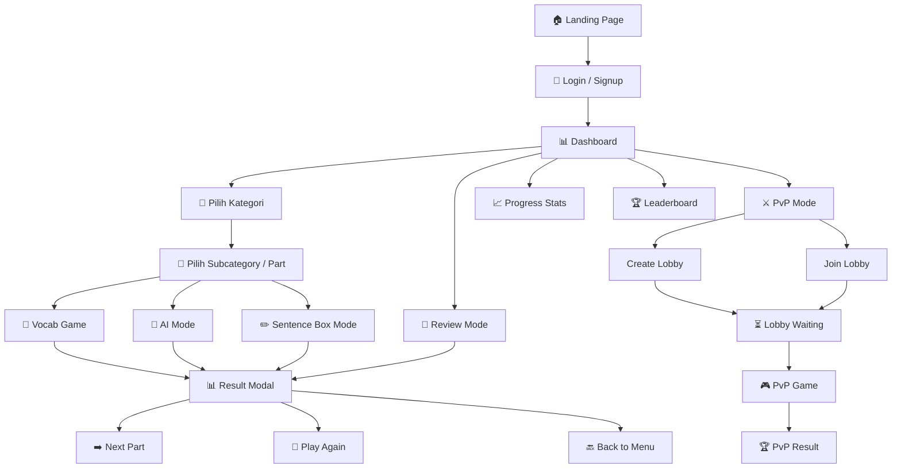
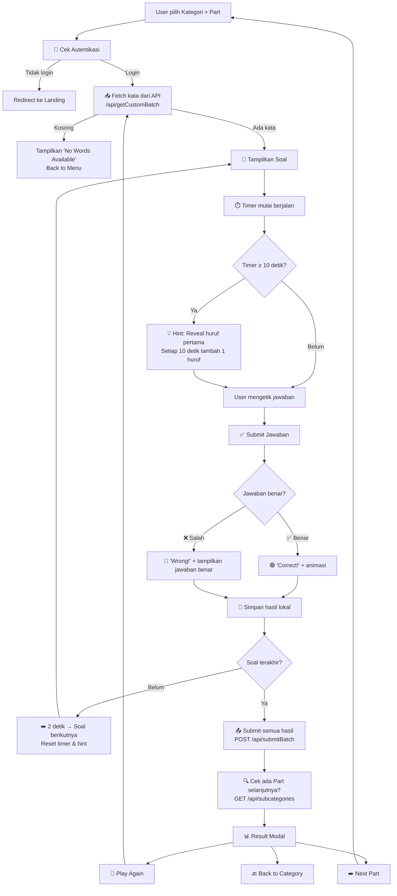
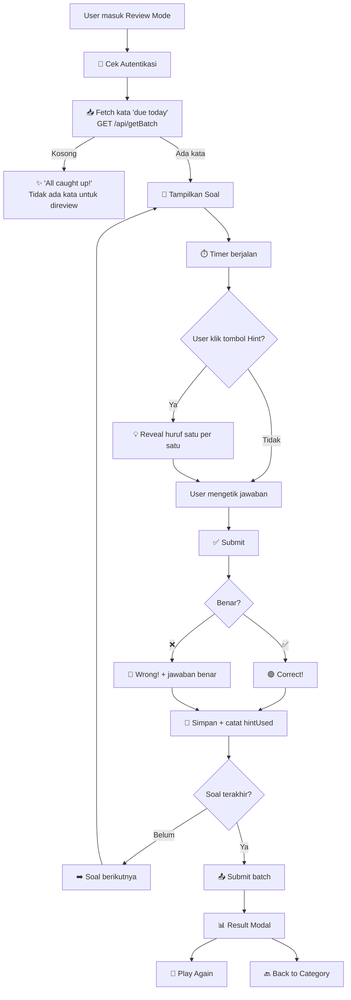
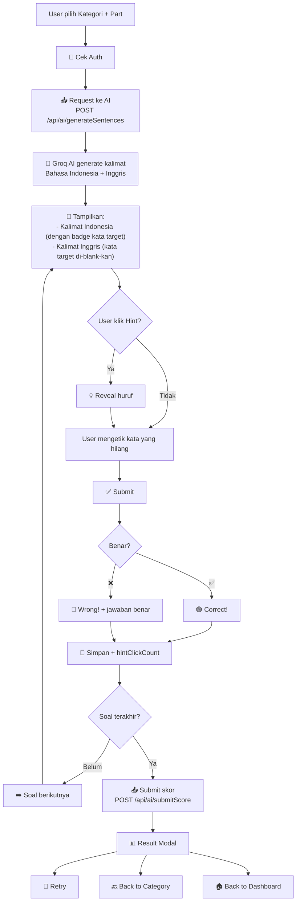
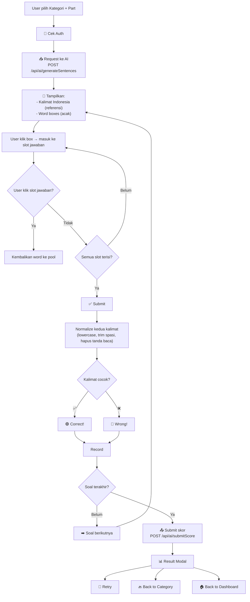
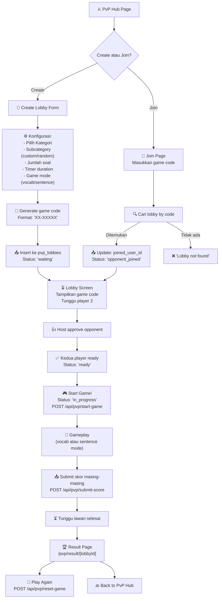
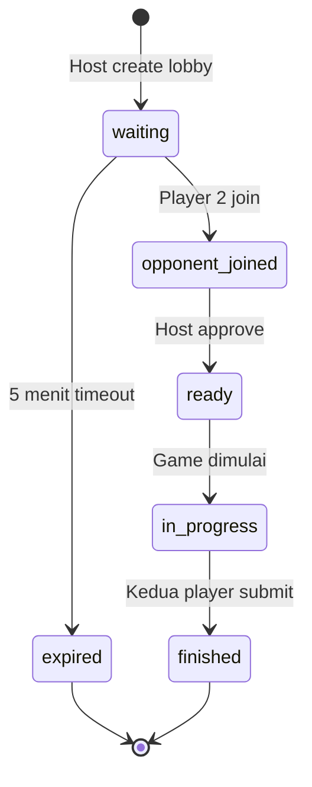
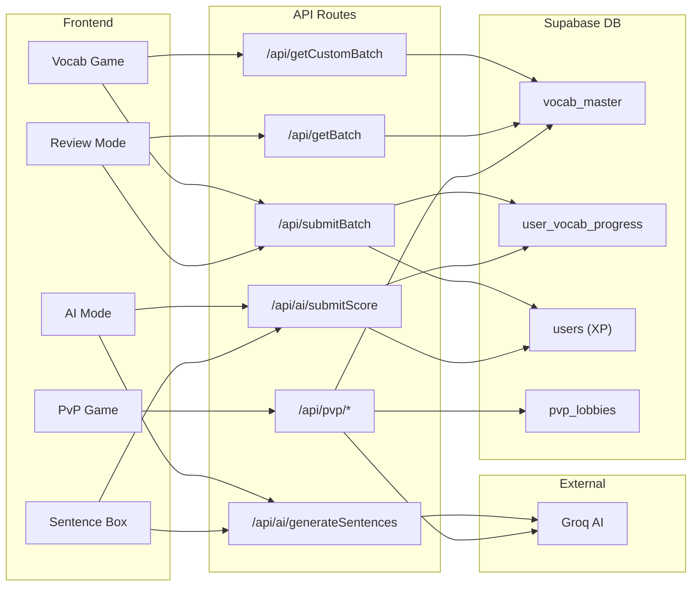

# 🎮 Ryurex Edu - Alur Game (Game Flow)

> Dokumentasi lengkap alur permainan di Ryurex Edu Vocab Game.

---

## 🗺️ Overview Semua Mode



---

## 1. 🎯 Vocab Game (Mode Utama)

Mode inti di mana user menerjemahkan kata Indonesia → Inggris dengan mengetik jawaban.

### Alur Lengkap



### Detail Mekanisme

| Fitur | Detail |
|---|---|
| **Input** | Hidden input + visual underscore display |
| **Spasi** | Otomatis ditambahkan sesuai jawaban benar |
| **Hint** | Auto-reveal setiap 10 detik (huruf 1, 2, 3, ...) |
| **Jawaban** | Case-insensitive, harus lengkap (panjang = jawaban benar) |
| **Feedback** | 2 detik tampil sebelum lanjut ke soal berikutnya |
| **Batch Submit** | Semua hasil dikirim sekaligus di akhir sesi |

### Kalkulasi XP

| Kondisi | XP |
|---|---|
| ✅ Benar & jawab ≤ 5 detik | **+15 XP** ⚡ |
| ✅ Benar & jawab < 10 detik | **+10 XP** 🔥 |
| ✅ Benar & jawab ≥ 10 detik | **+0 XP** ⏱️ |
| ❌ Salah | **+0 XP** |

---

## 2. 📖 Review Mode (Spaced Repetition)

Mode untuk mereview kata-kata yang sudah pernah dipelajari, menggunakan sistem spaced repetition.

### Alur Lengkap



### Perbedaan dengan Vocab Game

| Fitur | Vocab Game | Review Mode |
|---|---|---|
| **Sumber kata** | Semua kata di kategori | Hanya kata dengan `next_due ≤ today` |
| **Hint** | Auto setiap 10 detik | Manual (klik tombol) |
| **Tujuan** | Belajar kata baru | Mengulang kata yang sudah dipelajari |
| **Spaced Repetition** | Tidak | Ya (berdasarkan `next_due`) |
| **Data result** | `time_taken` | `time_taken` + `hintUsed` |

---

## 3. 🤖 AI Mode (Konteks Kalimat)

Mode di mana AI (Groq) membuat kalimat context, dan user menebak kata yang hilang di kalimat tersebut.

### Alur Lengkap



### Contoh Soal AI Mode

```
Kalimat Indonesia: "Kucing itu tidur di atas [meja]"
Kalimat Inggris:   "The cat sleeps on the _____"
Jawaban:            "table"
```

### Data yang disimpan per soal

```typescript
{
  vocab_id: number,
  correct: boolean,
  hintClickCount: number,  // berapa kali hint diklik
  userAnswer: string,
  questionData: {           // data kalimat dari AI
    id, indo, english, class, category,
    subcategory, sentence_indo, sentence_english
  }
}
```

---

## 4. ✏️ Sentence Box Mode (Susun Kalimat)

Mode di mana user menyusun kalimat Inggris dari word boxes yang diacak.

### Alur Lengkap



### Mekanisme Word Box

1. Kalimat dipecah jadi kata-kata individual
2. Kata-kata diacak posisinya
3. User klik urutan kata yang benar
4. Bisa hapus kata dari slot jawaban (klik untuk remove)
5. Tombol "Clear" mengembalikan semua

---

## 5. ⚔️ PvP Mode (Multiplayer)

Mode kompetitif antara 2 pemain secara real-time.

### Alur Lengkap



### Status Lifecycle Lobby



### Konfigurasi Game PvP

| Setting | Options |
|---|---|
| **Kategori** | Dari daftar `vocab_master` categories |
| **Subcategory** | Custom (pilih Part) atau Random |
| **Jumlah Soal** | ≥ 1 |
| **Timer** | ≥ 5 detik per soal |
| **Game Mode** | `vocab` (terjemahkan kata) atau `sentence` (AI-generated) |

### Data Skor yang Disimpan

Per player:
- Total questions, correct answers, wrong answers
- Accuracy percent
- Total time (ms), average time per question (ms)
- Fastest & slowest answer time (ms)
- Detail per soal (`jsonb`): vocab_id, answer, isCorrect, timeTakenMs

---

## 🔄 Flow Data Keseluruhan



---

## 📱 Halaman & Routing

| Route | Halaman | Keterangan |
|---|---|---|
| `/` | Landing Page | Halaman utama, CTA login |
| `/login` | Login | Login dengan Supabase Auth |
| `/signup` | Signup | Registrasi user baru |
| `/forgot-password` | Forgot Password | Reset password via email |
| `/update-password` | Update Password | Update password baru |
| `/dashboard` | Dashboard | Hub utama setelah login |
| `/category-menu` | Category Menu | Browse semua kategori |
| `/vocabgame?category=X&subcategory=Y` | Vocab Game | Game terjemahan kata |
| `/review-mode?category=X` | Review Mode | Review kata due today |
| `/ai-mode?category=X&subcategory=Y` | AI Mode | Game konteks kalimat AI |
| `/ai-mode/select` | AI Mode Select | Pilih kategori untuk AI mode |
| `/sentence-box-mode?category=X&subcategory=Y` | Sentence Box | Susun kalimat dari boxes |
| `/pvp` | PvP Hub | Menu utama PvP |
| `/pvp/create` | Create Lobby | Form buat lobby |
| `/pvp/join` | Join Lobby | Join lobby via kode |
| `/pvp/lobby/[code]` | Lobby Waiting | Ruang tunggu lobby |
| `/pvp/game/[lobbyId]` | PvP Game | Gameplay PvP |
| `/pvp/result/[lobbyId]` | PvP Result | Hasil pertandingan PvP |
| `/progress-stats` | Progress Stats | Statistik belajar detail |
| `/settings` | Settings | Pengaturan user |
